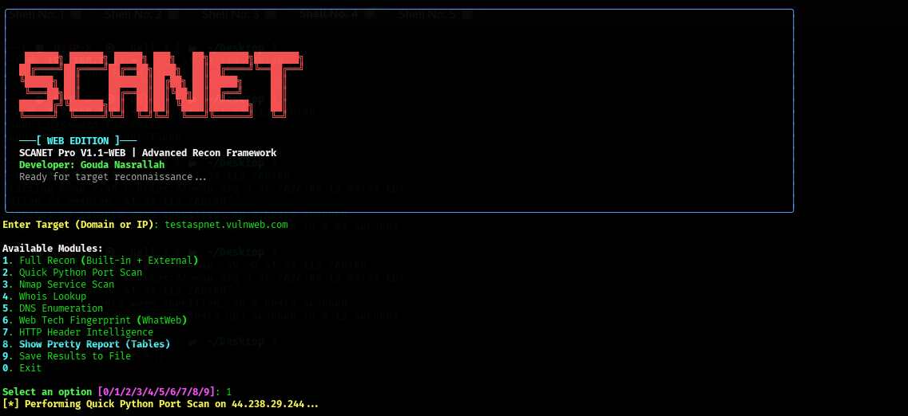

<p align="center">
  
</p>

<p align="center">
  <strong>SCANET-Web V1.1-WEB</strong><br>
  <em>Advanced Reconnaissance & Intelligence Framework for Kali Linux</em>
</p>

---

## 🌟 Overview | نظرة عامة
**SCANET-Web** is a professional-grade reconnaissance tool designed for security researchers and ethical hackers. It integrates powerful built-in Python scanning logic with industry-standard Kali Linux tools like Nmap, Whois, Dig, and WhatWeb, providing a unified and beautiful interface for information gathering.

**SCANET-Web** هي أداة استطلاع احترافية مصممة لباحثي الأمن والمخترقين الأخلاقيين. تدمج الأداة بين منطق فحص Python القوي وأدوات Kali Linux القياسية مثل Nmap و Whois و Dig و WhatWeb، مما يوفر واجهة موحدة وجميلة لجمع المعلومات.

---

## 🚀 Key Features | المميزات الرئيسية

### 🇬🇧 English
- **Modular Design**: Choose between specific tools or a full automated recon.
- **Tool Integration**: Seamlessly runs Nmap, Whois, Dig, and WhatWeb.
- **Smart Parsing**: Automatically parses raw tool outputs into clean, structured tables.
- **Reporting**: Export all findings to JSON for further analysis.
- **Interactive UI**: User-friendly CLI with a professional design and banners.

### 🇪🇬 بالعربي
- **تصميم معياري**: اختر بين أدوات محددة أو استطلاع آلي كامل.
- **تكامل الأدوات**: تشغيل Nmap و Whois و Dig و WhatWeb بسلاسة.
- **تحليل ذكي**: يحول مخرجات الأدوات الخام إلى جداول منظمة ونظيفة تلقائياً.
- **التقارير**: تصدير جميع النتائج إلى ملف JSON لمزيد من التحليل.
- **واجهة تفاعلية**: واجهة سطر أوامر سهلة الاستخدام مع تصميم وشعارات احترافية.

---

## 🛠️ Installation | التحميل والتثبيت

### Prerequisites
- **Kali Linux** (Recommended for full tool compatibility).
- **Python 3.x**
- **System Tools**: `nmap`, `whois`, `dnsutils` (for dig), `whatweb`.

### Setup
```bash
# Clone the repository
git clone https://github.com/GoudaWolfDev/SCANET-Web.git

# Enter the directory
cd SCANET-Web

# Install Python dependencies
pip install rich requests
```

---

## 💻 Usage | التشغيل

To start the tool, run:
```bash
python3 scan.py
```
Follow the interactive menu to select your target and choose the scanning module you need.

---

## ⚖️ License & Usage Policy | الترخيص وسياسة الاستخدام

Copyright (c) 2026 **Gouda Nasrallah**

### 🇬🇧 Usage Policy (IMPORTANT)
This tool is provided for **Personal Use Only**. 
- Any commercial use, redistribution, or modification for public release is strictly prohibited without explicit written permission from the author.
- Use this tool only on systems you are authorized to test. The author is not responsible for any misuse or legal consequences.

### 🇪🇬 سياسة الاستخدام (هام جداً)
هذه الأداة مقدمة **للاستخدام الشخصي فقط**.
- يُحظر تماماً أي استخدام تجاري أو إعادة توزيع أو تعديل للنشر العام دون إذن كتابي صريح من المؤلف.
- استخدم هذه الأداة فقط على الأنظمة المصرح لك باختبارها. المؤلف غير مسؤول عن أي سوء استخدام أو عواقب قانونية.

---

## 👨‍💻 Developer
Developed with 💻 by [Gouda Nasrallah](https://github.com/GoudaWolfDev)
